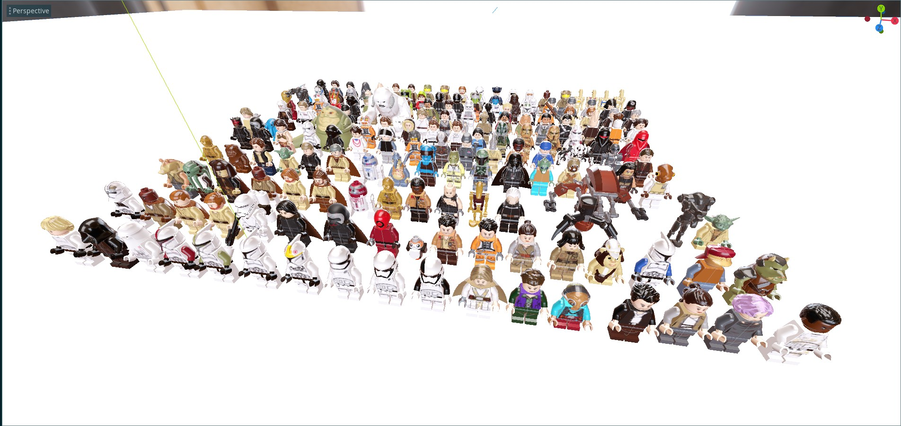

# Brick FPS

This project aims to create a similar game to Star Wars: Battlefront (2004) using LEGO style assets.

## Licensing

If at any point you believe this project contains copyrighted or wrongly attributed material, please create an [issue](https://github.com/rjkilpatrick/BrickFPS/issues) and it will be removed.

This is a fan project, and is not affiliated with the LEGO group or Lucasfilm.

LEGO® is a registered trademark of the LEGO Group, which does not sponsor, endorse, or authorise this project. Visit the official Lego website at <http://www.lego.com/>.

Star Wars is a registered trademark of Lucasfilm Ltd.

### Third party dependacies

Assets are modified from the fantastic [LDraw Parts Library](https://www.ldraw.org) and its unofficial parts library. Both are released under the [CC BY 2.0 License](https://creativecommons.org/licenses/by/2.0/).
Parts not in the LDraw library have been modified from those on [Digital Bricks](http://www.digital-bricks.de/en/index.php).
These can be in the corresponding assets folders.

### Code

All code is licensed under the [MIT License](godot/LICENSE).
